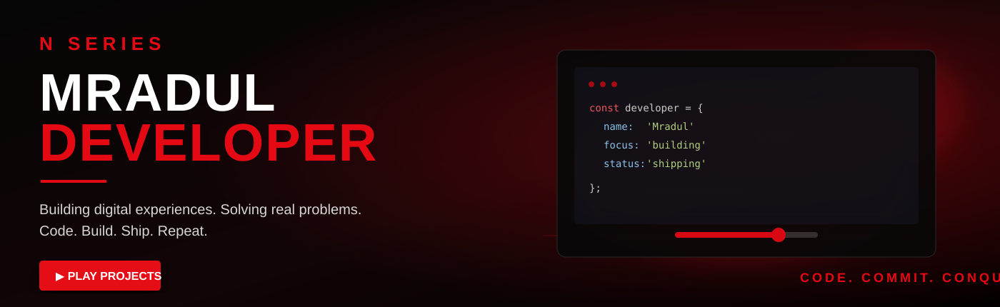
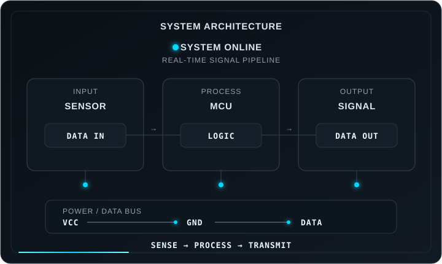

<div align="center">



</div>

<br>

<div align="center">
<a href="#projects">PROJECTS</a> &nbsp;&nbsp;•&nbsp;&nbsp;
<a href="#ece">ECE LAB</a> &nbsp;&nbsp;•&nbsp;&nbsp;
<a href="#stack">TOOLBOX</a> &nbsp;&nbsp;•&nbsp;&nbsp;
<a href="#contributions">CONTRIBUTIONS</a> &nbsp;&nbsp;•&nbsp;&nbsp;
<a href="#about">ABOUT</a> &nbsp;&nbsp;•&nbsp;&nbsp;
<a href="#connect">CONNECT</a>
</div>

---

##  FEATURED BUILD

<table>
<tr>
<td width="55%" valign="top">

### THE ENGINEERING JOURNEY

**Electronics × Embedded Systems × Software**

I like working at the boundary between hardware and code — understanding how a signal travels, how a circuit behaves, and how software can control the system around it.

`ECE` &nbsp; `EMBEDDED` &nbsp; `SIGNALS` &nbsp; `SOFTWARE`

<br><br>

[▶ EXPLORE BUILDS](https://github.com/mradulx) &nbsp;&nbsp; [VIEW SOURCE](https://github.com/mradulx)

</td>
<td width="45%" valign="top" align="center">

</td>
</tr>
</table>

---

<a name="projects"></a>

##  ENGINEERING BUILDS

<table>
<tr>
<td width="20%" valign="top">

**01**
### EMBEDDED
`MCU / IoT`

Hardware + firmware projects.

**◉ ◉ ◉ ◉ ◉**

[VIEW →](https://github.com/mradulx)

</td>
<td width="20%" valign="top">

**02**
### SIGNAL LAB
`DSP / SIGNALS`

Exploring signals, sampling and processing.

**◉ ◉ ◉ ◉ ◉**

[VIEW →](https://github.com/mradulx)

</td>
<td width="20%" valign="top">

**03**
### DIGITAL LOGIC
`DIGITAL / RTL`

Logic, systems and digital design.

**◉ ◉ ◉ ◉ ○**

[VIEW →](https://github.com/mradulx)

</td>
<td width="20%" valign="top">

**04**
### COMMUNICATION
`RF / DATA`

Communication and data systems.

**◉ ◉ ◉ ◉ ○**

[VIEW →](https://github.com/mradulx)

</td>
<td width="20%" valign="top">

**05**
### SOFTWARE
`CODE / TOOLS`

Software that makes systems useful.

**◉ ◉ ◉ ◉ ◉**

[VIEW →](https://github.com/mradulx)

</td>
</tr>
</table>

> **LAB STATUS:** `ACTIVE` · Real engineering projects will be added here as they are built.

---

<div align="center">
<table>
<tr>
<td width="35%" valign="top">

<a name="ece"></a>
##  ECE LAB

### SIGNAL MONITOR

```text
CH-1  ─────────────────────────
      ▁▂▃▄▆▇█▇▆▄▃▂▁▂▄▆█▇▅▃▂

FREQ    1.00 kHz
V/DIV   1.00 V
T/DIV   10 ms
MODE    AUTO
STATUS  ● LIVE
```

**BUILD → MEASURE → DEBUG → REPEAT**

</td>
<td width="35%" valign="top">

<a name="stack"></a>
##  ENGINEERING TOOLBOX

<div align="center">
 &nbsp;
 &nbsp;

<br><br>
 &nbsp;
 &nbsp;
 &nbsp;

<br><br>
<sub>MICROCONTROLLERS · EMBEDDED · PYTHON · C/C++</sub><br>
<sub>GIT · GITHUB · DEBUGGING · SYSTEM DESIGN</sub>
</div>

<br>
> **TOOLBOX:** Hardware, firmware and software — connected.

</td>
<td width="30%" valign="top">

##  GITHUB SIGNAL

<div align="center">

### `mradulx`

| | |
|:---:|:---:|
| **STARS** | **COMMITS** |
| `TRACKING` | `TRACKING` |
| **REPOS** | **CONTRIBUTIONS** |
| `ACTIVE` | `BUILDING` |

<br>
[](https://github.com/mradulx?tab=followers)

[VIEW PROFILE ↗](https://github.com/mradulx)

</div>
</td>
</tr>
</table>
</div>

---

<a name="contributions"></a>

##  CONTRIBUTION SNAKE

<div align="center">


<br>

`CONTRIBUTIONS` → `SNAKE` → `BUILD` → `REPEAT`

</div>

---

<a name="about"></a>

##  ABOUT THE ENGINEER

<table>
<tr>
<td width="70%" valign="top">

### MRADUL SINGH

**ECE Engineer** · Developer · Builder · Lifelong Learner

I'm interested in electronics, embedded systems, software and the engineering process behind turning an idea into a working system.

I enjoy the part where theory becomes practical: **design → prototype → test → debug → improve.**

`INDIA` &nbsp; `ECE` &nbsp; `BUILDING` &nbsp; `LEARNING`

</td>
<td width="30%" valign="top">

###  ENGINEERING MINDSET

`SYSTEMS`

Think in blocks.

`SIGNALS`

Measure before guessing.

`HARDWARE`

Build it. Test it.

`SOFTWARE`

Automate the boring parts.

`DEBUG`

Find the real problem.

</td>
</tr>
</table>

---

<a name="connect"></a>

##  CONNECT

<div align="center">

[](https://github.com/mradulx)

**Have a circuit, system or idea worth building? Let's connect.**

</div>

---

<div align="center">


### MRADUL // ECE LAB

*DESIGN · MEASURE · DEBUG · BUILD*

`VCC` · `GND` · `DATA`

</div>
