<div align="center">


### `MRADUL // ENGINEERING MODE: ON`

**Electronics × Embedded Systems × Software**

[](https://github.com/mradulx)
[](https://github.com/mradulx)

</div>

---

## `01` — WHO I AM

<table>
<tr>
<td width="65%" valign="top">

### I build where **hardware meets code.**

I'm **Mradul Singh**, an ECE engineer who likes understanding systems from the signal level all the way up to the software interface.

I don't want my GitHub to look like a list of technologies. I want it to show a pattern:

> **Learn → Build → Break → Debug → Improve → Ship**

My sweet spot is the intersection of **embedded systems, electronics, programming, problem solving and real-world engineering.**

</td>
<td width="35%" valign="top">

### `SYSTEM STATUS`

`●` **ONLINE**

**ROLE**  ECE / Developer

**FOCUS** Embedded + Software

**MODE** Building

**MINDSET** Curious

**NEXT** Bigger systems

</td>
</tr>
</table>

---

## `02` — NOW BUILDING

<a href="https://github.com/mradulx/pulselab">

</a>

### **PulseLab** — Real-time IoT monitoring

`ESP32` · `MQTT` · `FastAPI` · `WebSockets` · `React` · `TypeScript`

A system connecting **sensor telemetry → backend → database → live dashboard**. The goal isn't another demo app; it's learning how a complete hardware-to-software pipeline is actually engineered.

**STATUS:** `FOUNDATION / ARCHITECTURE`

---

## `03` — BUILDS WORTH SHOWING

<table>
<tr>
<td width="50%" valign="top">

### ⚡ Smart Billing System

An Arduino-based automatic shopping-cart / billing prototype using RFID-style product identification, LCD output, LEDs, buzzer feedback and serial input.

**What it represents:** turning electronics concepts into a working physical system.

`ARDUINO` `C/C++` `I2C` `LCD` `RFID`

[VIEW PROJECT →](https://github.com/mradulx/Smart-billing-system-)

</td>
<td width="50%" valign="top">

### 🧠 DSA Run

A dedicated space for algorithmic problem solving and strengthening the programming fundamentals that sit underneath larger engineering systems.

**What it represents:** consistency, logic and learning through repetition.

`DSA` `ALGORITHMS` `PROBLEM SOLVING`

_Private learning repository._

</td>
</tr>
</table>

---

## `04` — ENGINEERING TOOLBOX

<div align="center">


<br><br>

`MICROCONTROLLERS` · `EMBEDDED` · `C/C++` · `PYTHON` · `GIT` · `LINUX`

`APIs` · `REACT` · `TYPESCRIPT` · `DEBUGGING` · `SYSTEM DESIGN`

</div>

> **My rule:** tools are secondary. Understanding the system comes first.

---

## `05` — ECE LAB

```text
┌──────────────────────────────────────────────────────────────┐
│  SIGNAL MONITOR                              CH-1  ● LIVE    │
├──────────────────────────────────────────────────────────────┤
│                                                              │
│      ▁▂▃▄▆█▇▅▃▂▁      ▁▂▄▆█▇▆▄▂▁      ▁▂▃▅▇█▆▄▂            │
│  ────╱───────╲────────╱────────╲────────╱───────────        │
│                                                              │
│  FREQ     1.00 kHz       V/DIV     1.00 V                  │
│  T/DIV    10 ms          MODE      AUTO                    │
│  STATUS   BUILDING       SIGNAL    STABLE                  │
│                                                              │
└──────────────────────────────────────────────────────────────┘
```

### The engineering loop

**DESIGN** → **PROTOTYPE** → **MEASURE** → **DEBUG** → **ITERATE**

That loop is more important to me than memorizing another framework.

---

## `06` — CONTRIBUTION MISSION

<div align="center">



### `COMMIT → BUILD → DEBUG → REPEAT`


</div>

---

## `07` — CURRENTLY LEARNING

<table>
<tr>
<td width="33%" valign="top">

### `HARDWARE`

→ Microcontrollers

→ Sensors & interfaces

→ Embedded architecture

→ Digital electronics

</td>
<td width="33%" valign="top">

### `SOFTWARE`

→ Data structures

→ Python / C++

→ APIs & backends

→ Git & Linux

</td>
<td width="33%" valign="top">

### `SYSTEMS`

→ IoT pipelines

→ Telemetry

→ Real-time dashboards

→ Hardware ↔ software integration

</td>
</tr>
</table>

---

## `08` — GITHUB SIGNAL

<div align="center">


</div>

---

## `09` — ENGINEERING DNA

<div align="center">

| PRINCIPLE | WHAT IT MEANS |
|:---:|:---|
| `01` | **Understand before copying.** |
| `02` | **Measure before guessing.** |
| `03` | **Build small, then scale.** |
| `04` | **Debug the root cause.** |
| `05` | **Keep learning by making.** |

</div>

---

## `10` — LET'S BUILD

<div align="center">

**Have a circuit, embedded idea, software problem or interesting system?**

[](https://github.com/mradulx)

<br><br>

`VCC` · `GND` · `DATA` · `CODE`

### **MRADUL // ECE LAB**

*DESIGN. MEASURE. DEBUG. BUILD.*

</div>
